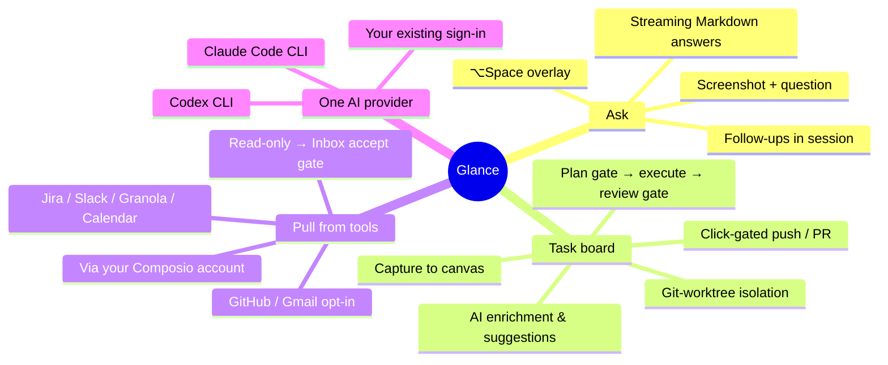
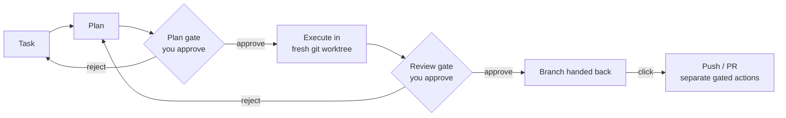
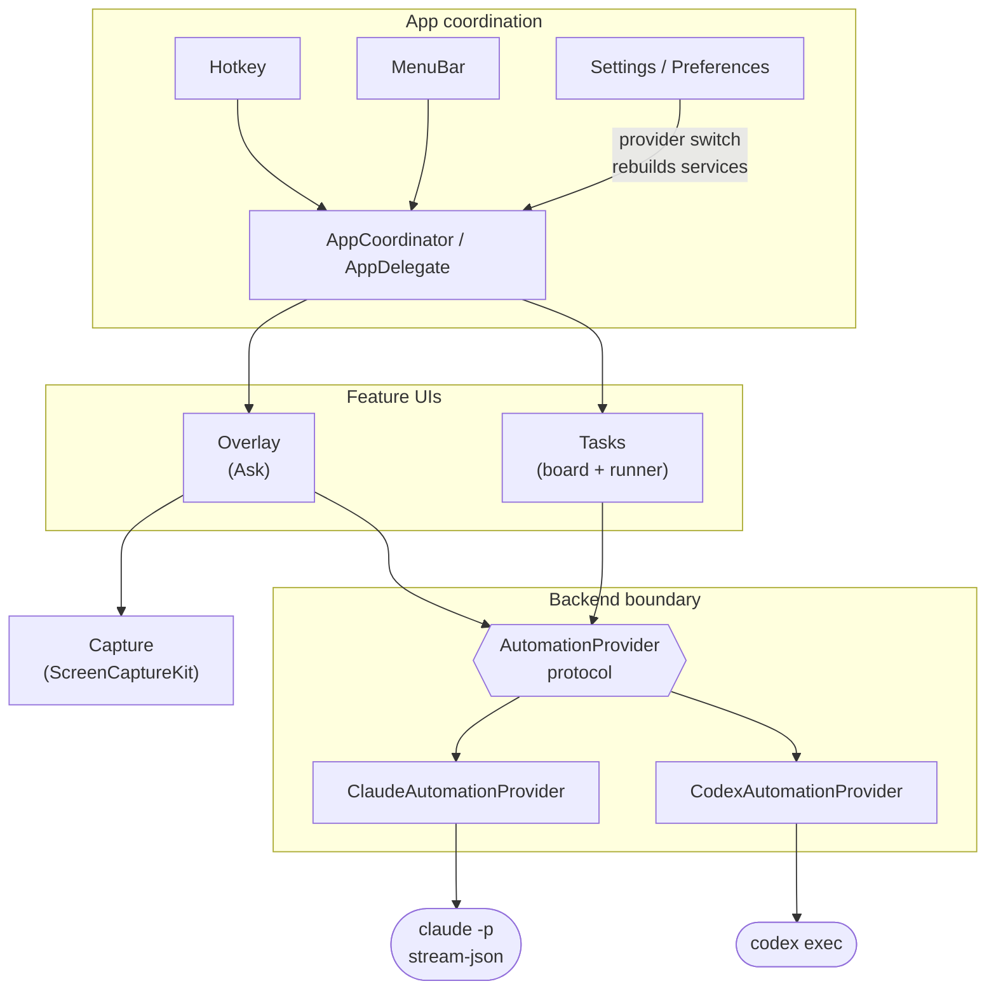

# Glance

A macOS menu-bar assistant that answers questions about whatever is on your
screen, runs tasks for you with human gates, and pulls work in from your
connected tools — without breaking flow. Choose your **locally
installed and signed-in Claude Code CLI or Codex CLI** in Settings; Glance
reuses that CLI's existing sign-in — no API keys, no Glance account, no
Glance-hosted subscription backend.

Implements the Screen-Aware Desktop Assistant PRD (FR/NFR numbers referenced
throughout the code and this README); specs and plans live under `docs/`.
Personal tool.

## What it does



### Ask about your screen

1. Hotkey (default **⌥Space**) → the active display is captured and a
   non-activating translucent overlay appears, input focused.
2. Type a question, press ↩. The screenshot + question go to the selected AI
   provider and the answer streams into the overlay as Markdown.
3. Ask follow-ups in the same overlay (context is kept). Press **Esc**, the
   hotkey again, or click away to dismiss — the session ends and the next
   invocation starts fresh.

### Task board with gated autopilot

A second hotkey opens the task board: capture tasks onto a canvas, let the AI
enrich and suggest them, then run them through a supervised pipeline:



- **Plan → plan gate → execute → review gate → boundary actions.** Every run
  needs your approval at the plan and review gates; notifications offer
  one-click approve/reject.
- **Isolation by construction.** `code` tasks run in a fresh `git worktree` —
  your checkout is never touched. An approved run hands back a branch;
  push/PR are separate gated actions executed only on click, and the agent
  process is denied `git push` / `gh pr *` at the CLI permission layer, not
  just by prompt.
- **Bounded execution.** At most two concurrent runs, one per repo, with a
  10-minute stall timeout and a 45-minute hard cap.

### Pull tasks from your tools

Manual, read-only ingestion from **Jira, Slack, Granola, and Calendar**
(GitHub, Gmail, and other connected apps are opt-in) through your own Composio
MCP account. Pulls only land suggestions in the local Inbox behind an accept
gate — the prompt hard-forbids any create/update/delete/send action. Composio
requires its separately configured endpoint and API key.

### First launch

A short onboarding tour covers the hotkeys, permissions, and provider choice.
The copy always reflects your current hotkey bindings.

## One selected AI provider

The locally signed-in CLI selected in Settings is the provider for every
AI-driven feature: Ask and its follow-ups, task planning and automation,
one-shot task enrichment and suggestions, and Composio connected-app
requests. Switching between Claude Code and Codex cancels
in-flight work from the previous selection before new requests begin.

When Codex is selected, Glance passes the Composio MCP settings only to the
specific Codex child process that needs them; it supplies the token only in
that child process's environment and does not add Composio to your global
Codex configuration.

## How it works (provider plumbing)

Claude Code runs one persistent

```
claude -p --input-format stream-json --output-format stream-json \
       --include-partial-messages --verbose
```

process per overlay session. Codex runs a local `codex exec` process per turn
and resumes the CLI session for follow-ups. The first question includes the
screenshot, so either provider can answer in a single turn with no permission
prompt. Processes are started only when an overlay is invoked to keep the idle
footprint negligible. Codex runs use `--ignore-user-config` so your global
`~/.codex` MCP servers and plugins never load into Glance's child processes.

## Requirements

- macOS 14 (Sonoma) or later.
- Claude Code CLI or Codex CLI installed and signed in (`claude` or `codex`
  working in your terminal). Select the installed provider in Settings.
- **Screen Recording** permission (System Settings → Privacy & Security →
  Screen Recording). Glance guides you there on first use.

## Settings

- Rebind the global hotkeys (Ask, task board).
- Launch at login.
- Choose the **AI provider**: Claude Code or Codex. The status row, Rescan, and
  Test actions apply to the selected local CLI, which is then used for every
  AI-driven feature.
- Task settings: Composio endpoint/API key, enabled pull sources, and
  per-task-type defaults.

## Privacy & cost — read this

This is a personal tool with deliberate, documented trade-offs (PRD NFR6):

- **Screenshots may contain sensitive content.** Each query is a real local
  Claude Code or Codex session, and either provider may retain its own local
  transcript or session data, including screenshots. Claude attachments remain
  in Glance memory while they are submitted. For Codex attachments, Glance
  creates a per-backend private temporary directory with mode `0700` and a PNG
  with mode `0600`; the PNG is deleted when the Codex turn reaches terminal
  success/error, the process exits or times out, or the session/app shuts down.
  Glance cannot control provider-owned local storage, so review and prune that
  CLI's local data if needed.
- **Queries use the selected provider account** and may count against its plan
  usage or provider-managed billing, depending on how that CLI is signed in.
- Glance makes **no network calls of its own** — traffic, if any, goes through
  the selected CLI's own connection (NFR5).

---

## Development

### Build, run, test

```sh
swift build                   # debug build
swift run Glance              # quick dev cycles (no stable code identity)
swift test                    # full XCTest suite
Scripts/build-app.sh          # release build/Glance.app (signed)
Scripts/build-app.sh debug    # app bundle from a faster debug build
open build/Glance.app         # permission-sensitive testing
```

Grant Screen Recording when prompted, then relaunch. The `.app` bundle is what
gets the stable code identity Screen Recording remembers — run
`Scripts/dev-sign-setup.sh` once to create a local signing identity so the
permission survives rebuilds.

### Architecture

Swift Package Manager executable, macOS 14+, no third-party dependencies.



Every AI feature talks to the `AutomationProvider` protocol, never to a CLI
directly. `Sources/Glance/` is grouped by feature:

| Folder | What lives there |
|---|---|
| `Backend/` | `AutomationProvider` boundary + `ClaudeAutomationProvider` / `CodexAutomationProvider` adapters, CLI locators, stream-JSON event decoding |
| `Overlay/` | Ask overlay: non-activating panel, session state, Markdown streaming |
| `Capture/` | ScreenCaptureKit still capture |
| `Tasks/` | Task board, canvas, `TaskRunner` pipeline, Composio ingest/catalog, review queue, notifications |
| `Hotkey/` | Carbon `RegisterEventHotKey` global hotkeys |
| `Settings/` | Preferences, hotkey recorder, launch-at-login (SMAppService) |
| `Onboarding/` | First-launch tour (pure-data pages, tested for coverage) |
| `MenuBar/`, `History/` | Status item, ask session history |

App coordination (`AppDelegate`, `AppCoordinator`) and design tokens sit at the
target root. The provider factory rebuilds all AI services when the selected
provider changes, and provider generations gate late callbacks from cancelled
work.

Linked frameworks: Carbon (hotkeys), ScreenCaptureKit (capture),
ServiceManagement (launch at login).

### Testing

XCTest suites live in `Tests/GlanceTests/` (`@testable import Glance`) and
cover the provider adapters, stream-event decoding, Composio argument wiring,
overlay/backend lifecycles, provider-generation gating, and the onboarding
catalog. Run `swift test` before every PR. Screen capture,
hotkeys, launch-at-login, and signing behavior must be exercised manually in
the bundled app — they depend on macOS permissions.

### Docs

Design notes, specs, and implementation plans are under `docs/`
(`docs/specs/`, `docs/superpowers/`, `docs/PLAN.md`). `AGENTS.md` carries the
contributor guidelines (structure, style, commit conventions).

### Distribution

Direct download, Developer ID–signed and notarized (NFR7). The signing and
notarization steps are sketched at the bottom of `Scripts/build-app.sh`.

## Not included (v1)

Stealth/hidden-from-screen-share behavior, other LLM providers, chat history
across invocations, multi-user/accounts, Windows/Linux, and Mac App Store
distribution. See the PRD "Out of Scope".
